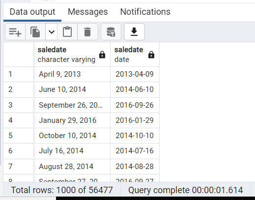
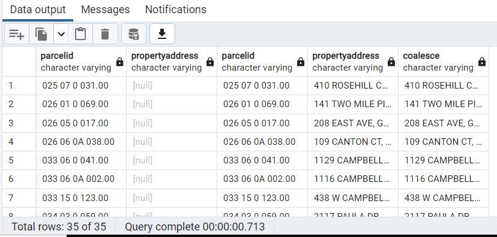
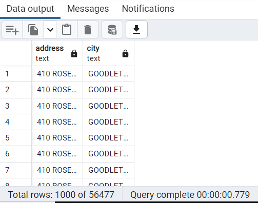
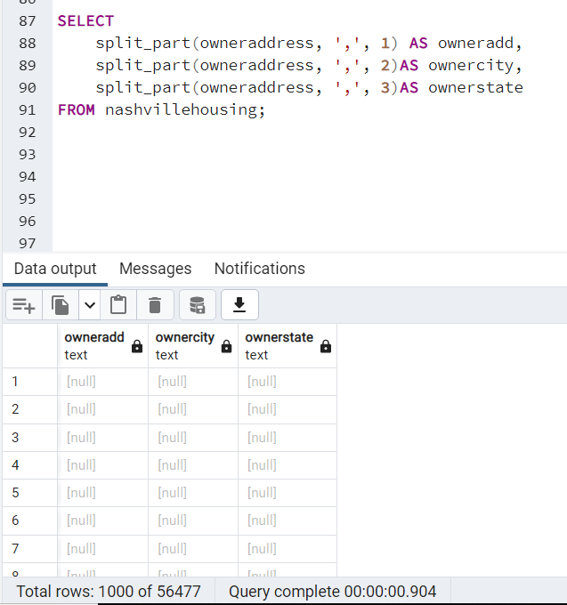
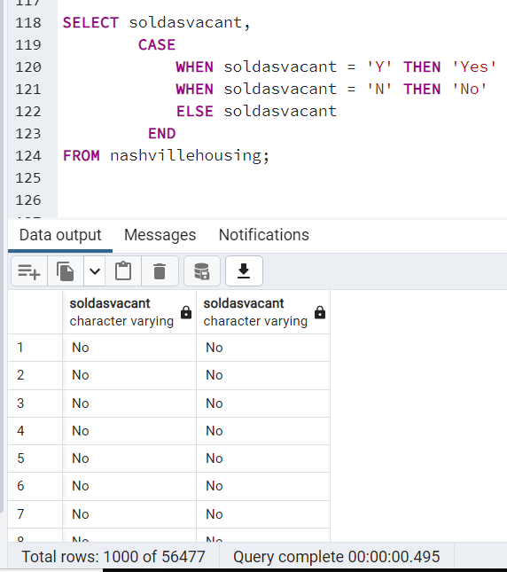
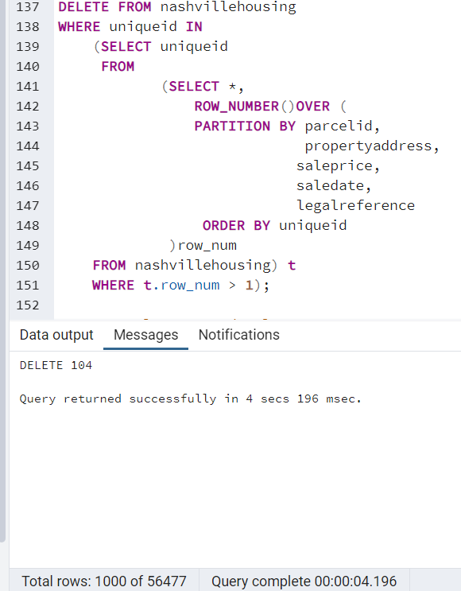
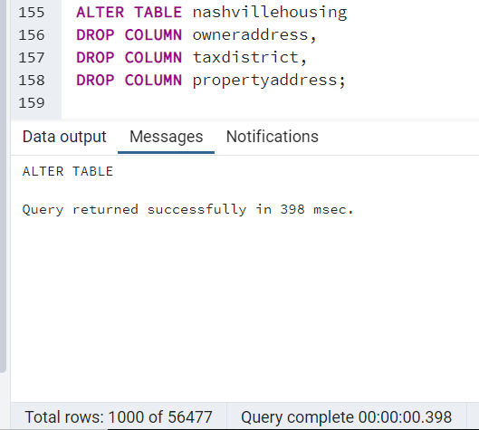

### NASHVILLE HOUSING DATA ANALYSIS: A DATA CLEANING PROJECT USING SQL

## Introduction
This project looks at Nashville Housing Dataset, a dataset containing statistics about land use and properties in Nashville, the capital city of Tennessee, USA. This project focuses on data cleaning using PostGreSQL. Data cleaning involves identifying incomplete, inaccurate or irrelevant part of the data and then modifying, replacing or deleting the dirty data. This is to ensure data quality and integrity which produces an accurate analysis. The result of the data cleaning process will be visualized using PowerBI.

## Data Collection
The dataset for this project was gotten from AlexTheAnalyst Github page which was originally downloaded from Kaggle. The dataset is composed of 19 columns and 56,477 rows. 

## Meta Data
- Unique ID: is the number attributed to a land.
- Parcel ID: Code attributed to a property
- Land Use: Shows the different uses of land
- Property Address: Address of the property
- SalesPrice: Cost of Land
-	Sale Date: Date the property was sold
- Legal Reference: Citation is the practice of coediting and referring to authoritative documents and sources.
- Sold as Vacant: Describes a vacant property which the buyer can move in immediately it is bought.
- Owner Name: Name of land owner
- Owner Address: The address of the property owner
- Acreage: The size of an area of land in acres
- Tax District: Region or locality that assesses real estate taxes on the properties located within its borders
- Land Value: The worth of the land
- Building Value: Worth of a building
- Total Value: Land value plus building value
- Year Built: Year the building was built
- Full Bath: A bathroom that includes a shower, bathtub, a sink, and a toilet
- Half Bath: a half bathroom only contains a sink and a toilet
- Bedrooms: Number of Bedrooms in the property

## Importing Data
I created a database named “Project” in PostGreSQL. Next, I created a table named NashvilleHousing which contained all the column names in the dataset then imported the dataset using the import/export tool. 

## Data Cleaning
- First, I standardized the Sale Date column by converting the data type from Varchar to a Date format.
  
   
-  29 rows from the Property Address column contained Null Values. I discovered that some rows have the same ParcelID and these set of rows have the same property address. I therefore populated the null values in the property address column with the property address of the same ParcelID by doing a self-join on the table using the ParcelID column to get the address of the rows with the same ParcelID using the COALESCE() function to replace the Null values.
  

-  Also, I separated the property address field into two different columns (City and House Address) as it was in the same column. To break out this address into the city and House address columns, I used the SPLIT_PART() function. This function is used to extract certain part of a string using a delimiter.
 
  

-  Similarly, I separated the Owner address column into three different columns: State, Address and City using the same function I applied for the property   address column.
  
  

-  The SoldAsVacant column has four options (Yes, No, Y and N). I changed the Y to ‘Yes’ and ‘N’ to No to ensure consistency across column using the CASE   statement.
  
  

-  Duplicate rows will harm the result of an analysis as it presents an inaccurate analysis therefore it is important to remove records that presents itself more  than once in a table to ensure accuracy. There are 104 duplicate rows in the dataset which I removed to ensure accurate analysis. I used a subquery to achieve this.
  
  

-  Finally, I deleted columns which are not useful for the analysis.
  
  

  
## Conclusion
After cleaning this dataset, I was left with 56,373 rows which I saved as an Excel file and exported into PowerBI for further analysis and visualization.
